# Explainability of trained model on CIFAR10

The model trained in the notebook serves the purpose of helping us understand what features are given importance while inferring on images. This is what we are terming as explainability of a model.

In a usual context, we train deep learning models to perform a particular task and then go with inferring, where new images are passed through the model to get an output. To understand how a model works, we need to understand how the weights get caliberated using images as example. This is performed by a technique called Grad-CAM which is a superior version of CAM.

## What is CAM?

CAM stands for **C**lass **A**ctivation **M**aps. What it means is that, based on the model trained, which regions of the images have a higher weight given when trying to predict the class of the image. The advantage of such techniques is, it helps us understand what features of an object present in the image are focused while predicting the class. An example image is attached below to show case how CAM looks like.

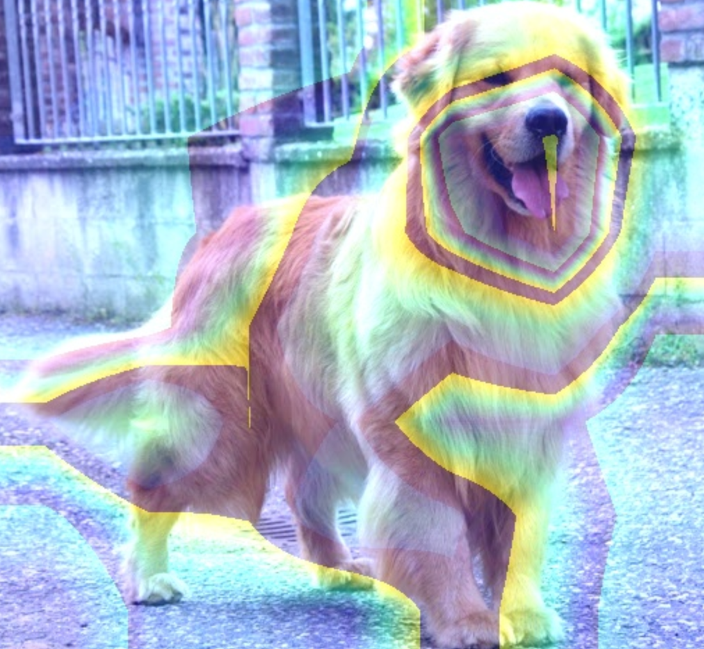

If we look at the image, we see that some parts of the image have lines, but its not really self-explanatory. So, to make it easy to understand which particular region of the image gets highlighted, the technique GradCAM was discovered.

## GradCAM

GradCAM stands for **Grad**ient **C**lass **A**ctivation **M**ap. The output of GradCAM looks like the example shown below:

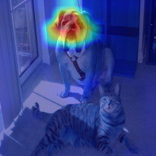

Looking at the GradCAM example, we can understand that the model while predicting the image as Dog class, looks majorly at the face of the dog. Getting such information helps us in improving the performance of a model for edge case scenarios.

Below, we have explained how we have used GradCAM to understand how the model we trained on CIFAR10 training data behaves on CIFAR10 test data.

## Implementation

The data preprocessing, training execution, explainbility of model, model architecture definition were done in the package developed by us called [ikshana](https://github.com/ikshana-ai/ikshana/tree/OneCycle).

### Model

We used a ResNet18 architecture to train the model on CIFAR 10 dataset. The 10 different classes that are available for classification in the dataset are represented using the image below:

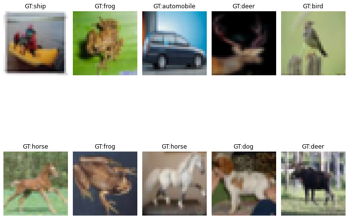

### Data Pre-processing

To train a good model, we used data augmentation strategies as there were similar kinds of data for different classes. The different data augmentation stratgies that we used were:

1. Padding
2. RandomCrop
3. CoarseDropout
4. Rotate

A sample set of images are displayed below:

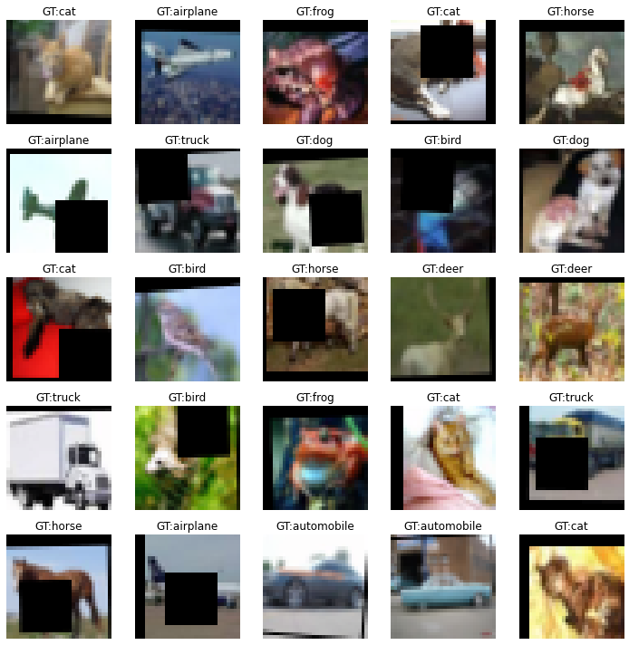

### Training

The ResNet18 model had 11,171,146 Parameters and it was trained on the dataset for 40 epochs. The result we observed: Training accuracy of **84.46%** and test accuracy of **84.61%**. 

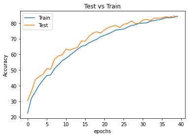
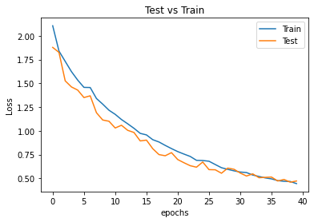

The inference results were converted into a confusion matrix to understand which classes had the most amount of False Positives.

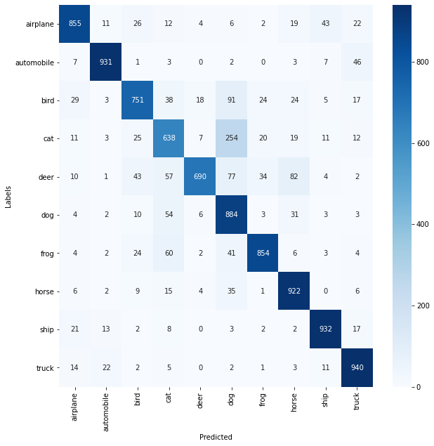

Looking at the heatmap, we can say that the model performed poorly on classes like bird, cat, deer, dog, frog. To understand why the classification of images belonging to these classes were less and understand why accuracy on other classes was comparitively high, we used GradCAM to understand these nuances.

### Explainability

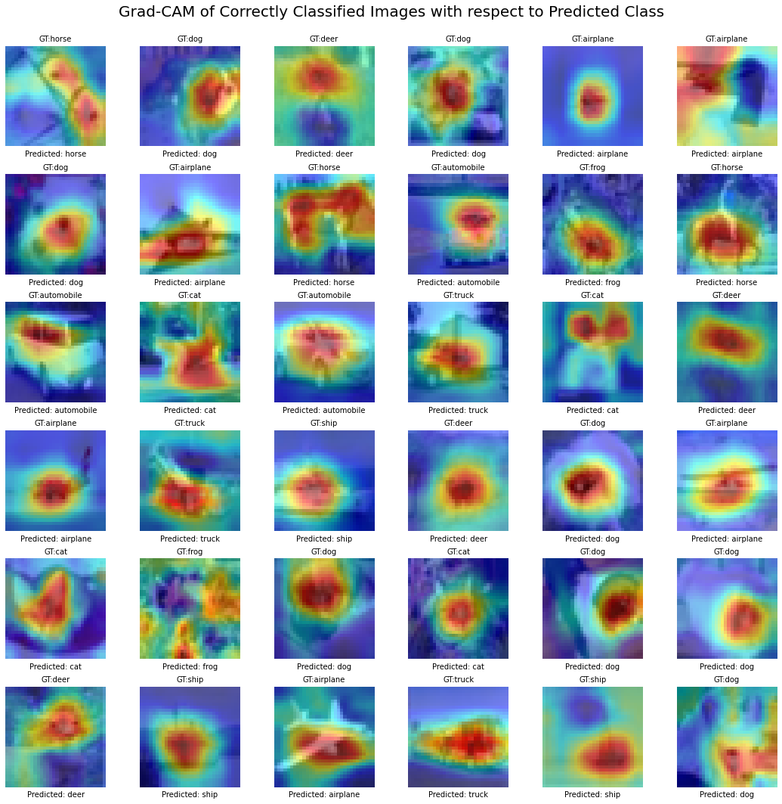

The above image represents why the prediction went correct for multiple images. The region where the model was focusing with respect to these images is in a very prominent region that helps distinguish between classes.

A subset of incorrect prediction images is shown below:

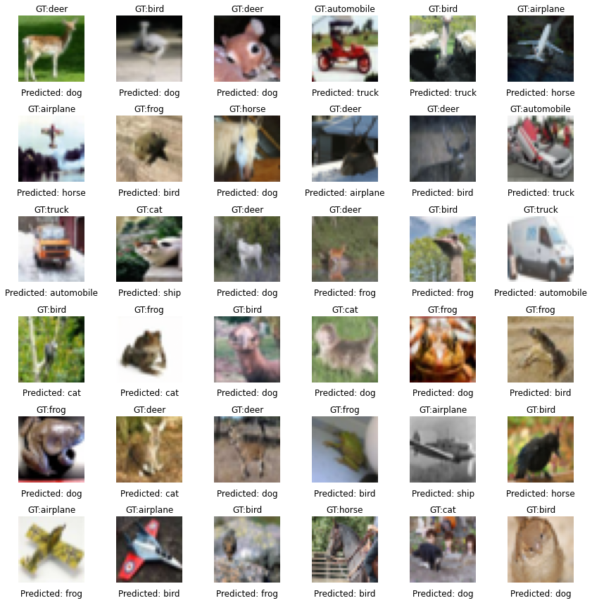

The explanations shown below helps us understand where the model is focusing to give its prediction.

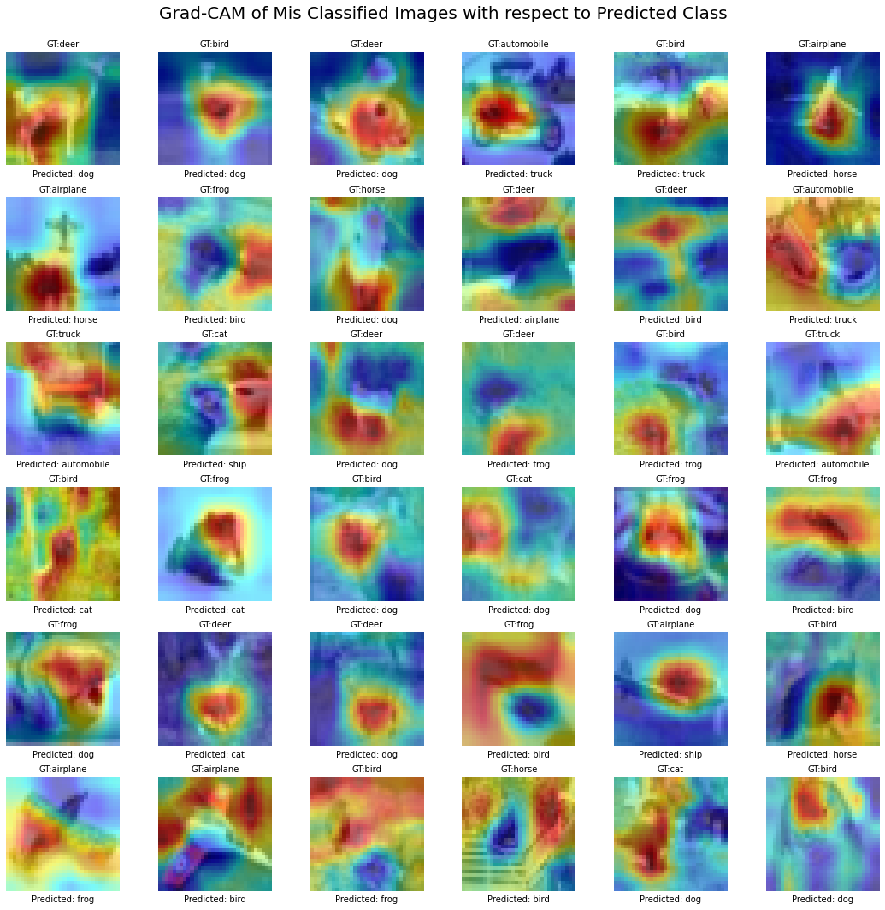
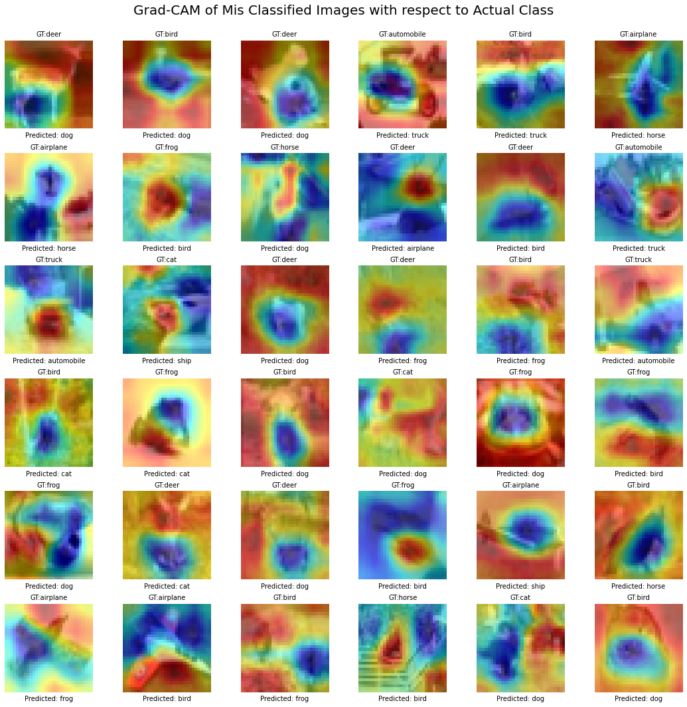

By observation, we can say that, the region where the model should be focusing on compared to the location where the model is actually focusing is completely different. So, this helps us come up with approaches that we can use to look at these mistakes and correct them by performing additional data pre-processing or perform weighted training or apply many more such techniques.

## Conclusion

GradCAM helps us understand where the model is actually focusing with respect to the object present in the image, acting as a visual cue to help us understand where the model predictions are going wrong and what can be done to improve the performance of the model on such images.

## Contributors

* Syed Abdul Khader
* Kaustubh Harapanahalli
* Kushal Gandhi
* Varsha Raveendran

## References

* <https://valentinaalto.medium.com/class-activation-maps-in-deep-learning-14101e2ec7e1>
